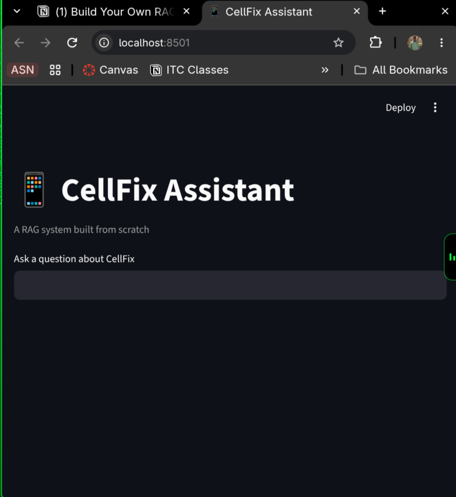

# RAG from Scratch 🚲

A Retrieval Augmented Generation (RAG) system built step by step in plain
Python — embeddings, chunking, vector search, and prompting — then
re-implemented with LangChain for comparison.

It answers questions about a fictional e-bike company, Lumen Cycles,
using only its internal documents, and cites its sources.

## How it works
1. **Ingest** — documents in `data/` are split into overlapping chunks
2. **Embed** — each chunk becomes a vector via an embedding model
3. **Store** — vectors are saved in a local ChromaDB database
4. **Retrieve** — a question is embedded and the closest chunks are found
5. **Generate** — the chunks are passed to an LLM with instructions to
   answer only from that context

## Quick start
    python3 -m venv .venv && source .venv/bin/activate
    pip install -r requirements.txt
    cp .env.example .env        # add your OpenAI key (or Ollama settings)
    python -m rag.ingest        # build the index
    python ask.py               # start asking questions

## Cellfix RAG UI

## What I learned
I learned how RAG actually works, before I believed it was just giving temporay files to any native chatbot and it would regurgitate infomation about said documents back to you. 

RAG system works a differently has the model before had no idea what said company was. It fixes that by handling the model the right documents at given time through chunking and Embedding. Embedding just match the meaning of each input through the vector mapping. While chunking reduces the already documents into chunks so that the model can process information with each token. Retrieval is half the battle. The model can only answer the questions through chunks it's given, which is why Streamlit app shows retrived chunks. 

What surpise me was that local ollama models behave differently from openai's models. The vectors are only 768 numbers instead of 153 and cosine vs L2 distance matters alot. 

## Acknowledgements
Inspired by Abhishek Veeramalla's
[RAG crash course](https://github.com/iam-veeramalla/RAG-crash-course).